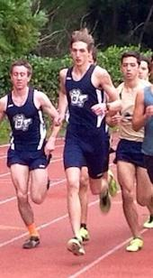

  
  <h1> Running </h1>
  
 "Runners: you don't get what you wish for, you get what you <i>work</i> for"   -Anonymous 

    
  
 "To give anything less than your best is to sacrifice the gift"   -Steve Prefontaine 

<h1> <a href="http://www.athletic.net/TrackAndField/Athlete.aspx?AID=6143155"> Oregon Institute of Technology : </a> Klamath Falls, OR </h1>
<h3> Coaches: <a href="http://www.oit.edu/athletics/mens-sports/cross-country/coaches">Jack Kegg, Laura Schwartz</a> </h3>
  

  <table border="1" style="width:100%" class="table-striped table">
    <caption style="font-size:150%">Freshmen Year (2013-14) Personal Records</caption>
    <tr style="font-size:125%">
      <th> Event: </th>
      <th> Season: </th>
      <th> Meet: </th>
      <th> Location: </th>
      <th> Time: </th>
      <th> Place: </th>
    </tr>
    <tr>
      <td> 8000m </td>
      <td> Cross Country </td>
      <td> NCU/OIT Dual </td>
      <td> Springfield, OR </td>
      <td> 26:10.6 </td>
      <td> 3rd </td>
    </tr>
    <tr>
      <td> 1500m </td>
      <td> Outdoor Track </td>
      <td> Chico Twilight </td>
      <td> Chico, CA </td>
      <td> 4:05.48 </td>
      <td> 2nd </td>
    </tr>
    <tr>
      <td> 1 mile </td>
      <td> Outdoor Track </td>
      <td> Humboldt Green & Gold </td>
      <td> Humboldt, CA </td>
      <td> 4:29.90 </td>
      <td> 3rd </td>
    </tr>
    <tr>
      <td> 800 </td>
      <td> Outdoor Track </td>
      <td> DII Challenge </td>
      <td> Chico, CA </td>
      <td> 2:01.16 </td>
      <td> 5th </td>
    </tr>
  </table>
  <h3><b> Highlights/Remarks: </b></h3>
    <ul style="font-size:125%">
      <li> Injured the entire year of competition with a benign tumor in my left knee </li>
      <li> Still competeted, but it was the most difficult season of my life </li>
      <li> One meet before Outdoor season ended, I stopped competing and scheduled surgery </li>
      <li> Underwent surgery mid-June and didn't run for a total of 3 months </li>
    </ul> 
  <table border="1" style="width:100%" class="table-striped table">
    <caption style="font-size:150%">Sophomore Year (2014-15) Personal Records</caption>
    <tr style="font-size:125%">
      <th> Event: </th>
      <th> Season: </th>
      <th> Meet: </th>
      <th> Location: </th>
      <th> Time: </th>
      <th> Place: </th>
    </tr>
    <tr>
      <td> 8000m </td>
      <td> Red Shirt Cross Country </td>
      <td> N/A </td>
      <td> N/A </td>
      <td> N/A </td>
      <td> N/A </td>
    </tr>
    <tr>
      <td> 1000m </td>
      <td> Indoor Track </td>
      <td> <a href="http://portal.stretchinternet.com/westmont/portal.htm?eventId=200004&streamType=video">Sunshine Indoor Open & Multi's</a> </td>
      <td> Santa Barbara, CA </td>
      <td> <b style="color:crimson"> 2:31.64 </b> (*B) </td>
      <td> 1st </td>
    </tr>
    <tr>
      <td> 1500m </td>
      <td> Outdoor Track </td>
      <td> Lane Twilight </td>
      <td> Eugene, OR </td>
      <td> <b style="color:crimson"> 3:56.08 </b> (*B) </td>
      <td> 2nd </td>
    </tr>
    <tr>
      <td> 800m </td>
      <td> Outdoor Track </td>
      <td> EOU Team Challenge </td>
      <td> Hermiston, OR </td>
      <td style="color:crimson"> <b>1:58.44</b> </td>
      <td> 1st </td>
    </tr>
  </table>
    
 * Indicitates NAIA National Qualifying mark; Automatic - "A", Provisional - "B"  <b style="color:crimson">Indicates lifetime personal best</b>  <a href="#"> Video link for specific meet performance</a> 

  <h3><b> Highlights/Remarks: </b></h3>
    <ul style="font-size:125%">
      <li> Red Shirted Cross Country as a result of summer surgery </li>
      <li> Qualified for Nationals both in Indoor and Outdoor Track: </li>
      <ul>
      <li { text-indent:-5px }> Indoor - 1000m; NAIA "B" Standard; held in Geneva, OH </li>
      </ul>
      <ul>
      <li { text-indent:-5px }> Outdoor - 1500m; NAIA "B" Standard; held in Gulf Shores, AL </li>
      </ul>
      <li> Awarded Cascade Conference Indoor Track Athlete of the Week - click <a href="http://www.cascadeconference.org/awards.aspx?aow=735">here</a> for full article </li>
    </ul>
  <h3> Wanting to go back to the High School days? Don't blame you.. <a href="running_hs.html">Here</a> is how! </h3>
  <h3> Want to stay updated with my running career? Follow my blog <a href="runningblog.html">here</a>! </h3>

