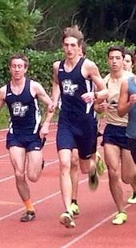

  
  <h1> Running </h1>
  
 "Runners: you don't get what you wish for, you get what you <i>work</i> for"   -Anonymous 

    
  
 "To give anything less than your best is to sacrifice the gift"   -Steve Prefontaine 

<h1> <a href="http://www.athletic.net/TrackAndField/Athlete.aspx?AID=6143155#L4"> Hidden Valley High School : </a> Grants Pass, OR </h1>
<h3> Coaches: Stan Goodell, Dave Johnson, Jeff Kasler, Josh Standley </h3>
   

  <table border="1" style="width:100%" class="table-striped table">
    <caption style="font-size:150%">Freshmen Year (2010) Personal Records</caption>
    <tr style="font-size:125%">
      <th> Event: </th>
      <th> Meet: </th>
      <th> Location: </th>
      <th> Time: </th>
      <th> Place: </th>
    </tr>
    <tr>
      <td> 3000m </td>
      <td> Wally Ciochetti Invitational </td>
      <td> Cottage Grove, OR </td>
      <td> 10:48.12 </td>
      <td> 28th </td>
    </tr>
    <tr>
      <td> 1500m </td>
      <td> Skyline District Meet </td>
      <td> Klamath Falls, OR </td>
      <td> 5:03.09 </td>
      <td> 10th </td>
    </tr>
    <tr>
      <td> 1 mile </td>
      <td> Medford Rotary Relays </td>
      <td> Medford, OR </td>
      <td> 5:42.93 </td>
      <td> 24th </td>
    </tr>
  </table>
  <h3><b> Highlights/Remarks: </b></h3>
    <ul style="font-size:125%">
      <li> First year of competitive running </li>
      <li> Improved in the 3000m by 1:36 from start to end of season </li>
      <li> Coach tried to get me to quit but I perservered </li>
      <li> Earned a Varsity Letter </li>
    </ul>
  <table border="1" style="width:100%" class="table-striped table">
    <caption style="font-size:150%">Sophomore Year (2010-11) Personal Records</caption>
    <tr style="font-size:125%">
      <th> Event: </th>
      <th> Meet: </th>
      <th> Location: </th>
      <th> Time: </th>
      <th> Place: </th>
    </tr>
    <tr>
      <td> 5000m (XC) </td>
      <td> Country Fair Classic </td>
      <td> Elmira, OR </td>
      <td> 18:27 </td>
      <td> 74th </td>
    </tr>
    <tr>
      <td> 3000m </td>
      <td> 62nd Annual Grants Pass Rotary (Frosh/Soph) </td>
      <td> Grants Pass, OR </td>
      <td> 9:24.23 </td>
      <td> 3rd </td>
    </tr>
    <tr>
      <td> 1500m </td>
      <td> Skyline District Meet </td>
      <td> Klamath Falls, OR </td>
      <td> 4:23.83 </td>
      <td> 10th </td>
    </tr>
    <tr>
      <td> 1 mile </td>
      <td> Bob Newland Class (Frosh/Soph) </td>
      <td> Medford, OR </td>
      <td> 4:52.75 </td>
      <td> 2nd </td>
    </tr>
    <tr>
      <td> 800m </td>
      <td> Wally Ciochetti Invitational </td>
      <td> Cottage Grove, OR </td>
      <td> 2:15.80 </td>
      <td> 21st </td>
    </tr>
  </table>
  <h3><b> Highlights/Remarks: </b></h3>
    <ul style="font-size:125%">
      <li> First year of running Cross Country </li>
      <li> "Breakthrough" Track Season </li>
      <li> Awarded Most Improved by team </li>
    </ul> 
  <table border="1" style="width:100%" class="table-striped table">
    <caption style="font-size:150%">Junior Year (2011-12) Personal Records</caption>
    <tr style="font-size:125%">
      <th> Event: </th>
      <th> Meet: </th>
      <th> Location: </th>
      <th> Time: </th>
      <th> Place: </th>
    </tr>
    <tr>
      <td> 5000m (XC) </td>
      <td> Marist XC Invite </td>
      <td> Eugene, OR </td>
      <td> 18:31 </td>
      <td> 26th </td>
    </tr>
    <tr>
      <td> 3000m </td>
      <td> Crater Classic </td>
      <td> Medford, OR </td>
      <td> 9:36.50 </td>
      <td> 8th </td>
    </tr>
    <tr>
      <td> 1500m </td>
      <td> Grants Pass Rotary Invitational </td>
      <td> Grants Pass, OR </td>
      <td> 4:04.16 </td>
      <td> 4th </td>
    </tr>
    <tr>
      <td> 800m </td>
      <td> Wally Ciochetti Invitational </td>
      <td> Cottage Grove, OR </td>
      <td> 2:01.64 </td>
      <td> 7th </td>
    </tr>
  </table>
  <h3><b> Highlights/Remarks: </b></h3>
    <ul style="font-size:125%">
      <li> Became injured at the start of Cross Country with 2 stress fractures in my left foot and didn't compete or run for 8 weeks </li>
      <li> Transitioned specialty from 3000m to 1500m </li>
      <li> Qualified for Oregon 4A State Championship Meet in the 1500m and placed 5th - <a href="http://oregonstatechampionships.runnerspace.com/eprofile.php?event_id=118&do=videos&video_id=68810">click</a> for video performance </li>
      <li> Awarded Most Inspirational by team </li>
      <li> Awarded 2nd Team All Conference for Track & Field </li>
    </ul>
  <table border="1" style="width:100%" class="table-striped table">
    <caption style="font-size:150%">Senior Year (2012-13) Personal Records</caption>
    <tr style="font-size:125%">
      <th> Event: </th>
      <th> Meet: </th>
      <th> Location: </th>
      <th> Time: </th>
      <th> Place: </th>
    </tr>
    <tr>
      <td> 5000m (XC) </td>
      <td> Northwest Classic </td>
      <td> Eugene, OR </td>
      <td> 16:35 </td>
      <td> 2nd </td>
    </tr>
    <tr>
      <td> 1500m </td>
      <td> Skyline Conference Championships </td>
      <td> Grants Pass, OR </td>
      <td> 4:03.16 </td>
      <td> 1st </td>
    </tr>
    <tr>
      <td> 800m </td>
      <td> Crater Classic </td>
      <td> Medford, OR </td>
      <td> 1:58.80 </td>
      <td> 2nd </td>
    </tr>
  </table>
  <h3><b> Highlights/Remarks: </b></h3>
    <ul style="font-size:125%">
      <li> Diagnosed with half-torn left achilles tendon after Cross Country season; subsequently couldn't run during the winter off-season and instead joined the Swim Team</li>
      <li> 1st Team All Conference in Cross Country and in Track & Field </li>
      <li> District Champion in the 1500m </li>
      <li> Awarded Most Valuable by team </li>
      <li> Ranked #1 going into the 4A Oregon State Championships in the 1500m but "choked" and got dead last </li>
      <li> Team finish of 4th Place in the 4A Oregon State Championship Meet in Cross Country </li>
      <li> Awarded 3rd Team All State in Cross Country </li>
    </ul> 
    
  <h3> Where is my college profile you ask? Click <a href="running_college.html">here</a> to explore! </h3>
  <h3> Want to stay updated with my running career? Follow my blog <a href="runningblog.html">here</a>! </h3> 

